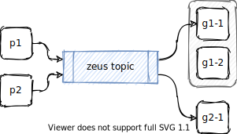

# kafka-go library usage

Small example of producer/consumer using [kafka-go](https://github.com/segmentio/kafka-go) library on local kubernetes cluster

<p align="center">
  
</p>

## Setup

Deploy [local kubernetes cluster](https://github.com/weak-head/multinode-k8s) and [enable kafka](https://github.com/weak-head/multinode-k8s#kafka).  

Once cluster is ready, deploy the consumer/producer example:

```sh
make deploy
```

## Check how it works

[Access kubernetes dashboard](https://github.com/weak-head/multinode-k8s#get-dashboard-auth-token) and check the logs of producer and consumer pods.